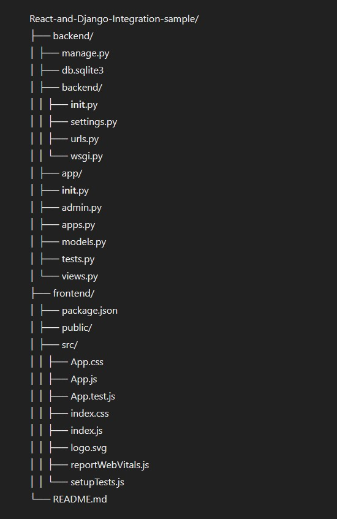

# React and Django Integration Sample

This repository contains a sample project demonstrating the integration of React and Django. The goal is to create a full-stack application where Django serves as the backend and React as the frontend.

## Project Structure

## Getting Started

### Prerequisites

- Python 3.x
- Node.js and npm
- Django
- Create React App

### Backend Setup

1. **Clone the repository:**

   git clone https://github.com/MrBytes10/React-and-Django-Integration-sample.git
   cd React-and-Django-Integration-sample/backend

2. **Create a virtual environment and activate it:**

   python -m venv venv
   source venv/bin/activate # On Windows, use `venv\Scripts\activate`

3. **Install dependencies:**
   pip install -r requirements.txt

4. **Apply migrations:**
   python manage.py migrate

5. **Run the Django server:**
   python manage.py runserver

### Frontend Setup

1. **Navigate to the frontend directory:**
   cd ../frontend

2. **Install dependencies:**
   npm install

3. **Run the React development server:**
   npm start

### Accessing the Application

- The React frontend will be available at `http://localhost:3000`
- The Django backend will be available at `http://localhost:8000`

## Project Overview

### Backend (Django)

The Django backend is a simple setup with one app (`app`) which can be expanded as needed. The `views.py` file contains the necessary API endpoints that the React frontend will consume.

### Frontend (React)

The React frontend is set up using Create React App. The structure follows the standard Create React App setup, with components and styles organized within the `src` directory.

## Contributing

1. Fork the repository
2. Create a new branch (`git checkout -b feature/your-feature-name`)
3. Make your changes
4. Commit your changes (`git commit -m 'Add some feature'`)
5. Push to the branch (`git push origin feature/your-feature-name`)
6. Open a pull request

## License

This project is licensed under the MIT License - see the [LICENSE](LICENSE) file for details.

## Contact

For any inquiries, feel free to contact the repository owner.

---

Happy coding!
